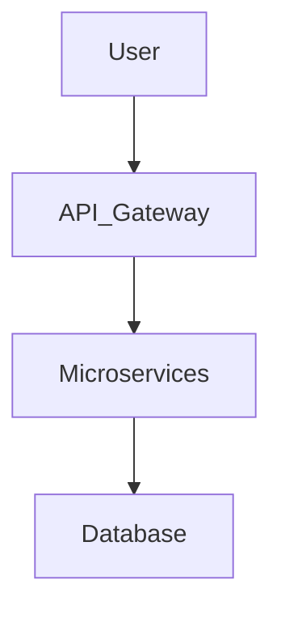
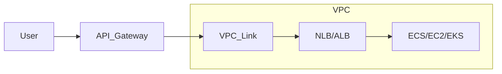

# Api Gateway - Microservices



## api-gateway-vs-service-mesh
An API gateway manages external requests into a system (north-south traffic),
while a service mesh manages internal communication between microservices 
within a system


## API Gateway: 
* Should /api/orders/123 go to order-service, order-read-service, or v2
  rollout, and should auth/rate-limit be applied first?

* AWS API Gateway HTTP API in front of Spring Boot services running on 
  ECS/EKS/EC2 behind an ALB/NLB. API Gateway HTTP APIs support private integration to ALB/NLB through a VPC Link.

* Client → API Gateway → VPC Link → ALB → Spring Boot service
  - A VPC link in AWS API Gateway enables private connectivity between API
    Gateway and HTTP APIs or REST APIs to backend services, such as an 
    Application Load Balancer (ALB), residing in a private VPC. It removes the 
    need for public endpoints, enhancing security and reducing latency by 
    using AWS PrivateLink to keep traffic within the AWS network.



## Recommended architecture for your Spring Boot microservices

Suppose you have:
* order-service → writes / commands
* order-read-service → queries / reads
* order-service-v2 → new version rollout

You could design:
* /api/orders/{id} GET → order-read-service
* /api/orders POST → order-service
* /api/orders/{id} PUT → order-service
* /api/v2/orders/* → order-service-v2

If you want one hostname for all clients:

api.company.com

Then API Gateway exposes:

* GET /api/orders/{id}
* POST /api/orders
* PUT /api/orders/{id}
* GET /api/v2/orders/{id}

and forwards each route to the correct internal target.


### First implementation path
* Option A — simplest and best for many teams: One API Gateway + one ALB + path-based routing on ALB

### Flow:
API Gateway forwards /api/* to ALB over VPC Link

### ALB listener rules route:
- /api/orders/* → order-service target group
- /api/order-reads/* → order-read-service target group
- /api/v2/orders/* → v2 target group

### Pros:
- API Gateway stays thin
- ALB does internal fan-out

your services remain easy to change

### Load balancer
Solves where to send traffic among identical service instances
Main job: distribution, health checks, failover
Example: spread requests across 10 order-service pods

### API gateway
Solves how clients enter the system
Main job: single entry point, auth, rate limiting, routing, versioning, request shaping
Example: /api/orders goes to order-service, /api/payments goes to payment-service

### Service mesh
Solves how services talk to each other internally
Main job: service-to-service security, retries, mTLS, traffic policy, observability
Example: order-service calling inventory-service with retries and mTLS

### Scale to a million users:

scale it in layers, not by just adding servers.

1. Remove single choke points
- API Gateway horizontally scalable
- multiple app instances behind ALB
- stateless Spring Boot services
- DB not on one fragile box

2. Scale reads first
- CDN for static/content-heavy traffic
- cache hot API responses with Redis
- read replicas for DB
-separate read and write paths if needed

3. Protect the core
- rate limiting at gateway
- backpressure and timeouts
- queues for async work
- circuit breakers for downstream calls

4. Decouple heavy flows
- move non-immediate work to Kafka/SQS
- email, reports, notifications, enrichment async
- user request should do minimum synchronous work

5. Scale data carefully
- add indexing first
- then partition/shard if needed
- isolate high-volume tables
- avoid cross-service chatty joins

6. Improve service design
- keep services stateless
- session data in Redis, not local memory
- idempotent APIs for retries
- pagination everywhere

7. Multi-region / resilience if traffic is truly massive
- active-passive first
- active-active only if business really needs it
- global routing / failover

8. Observability before aggressive scale
- p95/p99 latency
- error rate
- saturation: CPU, memory, connection pools, DB QPS, queue lag
- trace top user journeys

```graph

          Users
            |
            v
       CloudFront / CDN
            |
            v
        AWS WAF
            |
            v
        API Gateway
            |
            v
           ALB
            |
+-----------------------------+
|                             |
v                             v
Spring Boot service A        Spring Boot service B
(many stateless pods)        (many stateless pods)
|                             |
+-------------+---------------+
              |
              v
          Redis cache
              |    
    +---------+---------+
    |                   |
    v                   v
    RDS primary       Read replicas
    |
    v
    Kafka / SQS for async work
    |
    v
    workers / downstream processors
```

### Scaling to 10k users
  - single region is fine
  - API Gateway + ALB + a few Spring instances
  - one primary DB
  - basic Redis cache
  - basic autoscaling
  - logs, metrics, alarms
**Focus:** correctness, stability, observability

### 100k users
  - more aggressive horizontal scaling
  - Redis becomes important, not optional
  - DB read replicas
  - Kafka/SQS for async work
  - rate limiting and WAF
  - tighter timeout/retry/circuit breaker policies
  - maybe split hot services from rest
**Focus:** remove DB and sync-call bottlenecks

### 1M users
   - At 1M-user scale, I’d scale:
     - the edge, app, cache, async, and data layers independently.
     - I’d keep Spring Boot services stateless behind ALB, protect the system
       with API Gateway and WAF,
     - reduce hot reads with Redis and replicas,
     - and move non-critical work off the synchronous path with Kafka or SQS.
     - I’d scale based on observed bottlenecks—latency, DB pressure,
       and queue lag—not just by adding instances.
  - heavy caching strategy
  - strict async/event-driven offload
  - partitioning/sharding for hottest data if needed
  - stronger isolation between services/workloads
  - multi-AZ mandatory, multi-region considered
  - CDN for anything cacheable
  - advanced capacity and resilience testing
  - graceful degradation paths
**Focus:** bottleneck isolation, resilience, blast-radius control

- At 10k, I’d optimize for simplicity and observability. 
- At 100k, I’d focus on cache, async processing, and read scaling. 
- At 1M, I’d assume every shared dependency becomes a bottleneck and design for
  isolation, graceful degradation, and regional resilience.

https://chatgpt.com/g/g-p-698f44b7ee788191823229d54bda6877-tech-interview/c/69bc6450-1444-8328-818b-1c57009116db