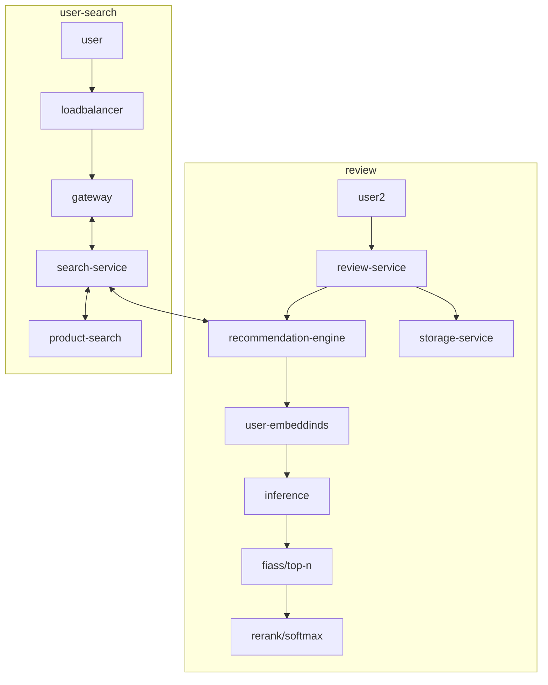
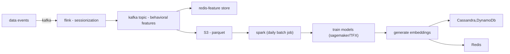
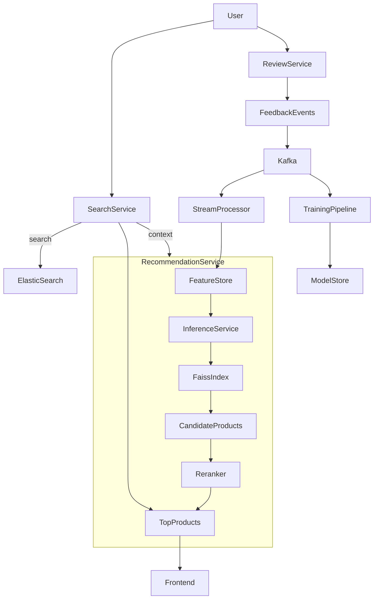

# Design Amazon's Product Recommendation System

# Design Scope
- web vs mobile (both)
- features:
  - user product suggestions
  - frequently bought  together
  - search based product recommendations
  - user upload of product reviews: (video/images/text)
  - feedback on reviews 
  - upvote/down vote and relevancy of reviews -> feed back to recommendation engine
- NFR's:
  - latency
  - scale (millions of products)
  - high availability
  - multi device support
- Assumptions:
  - 10 million DAU (scale 10x)
  - 100K products (scale to a million products)
- Integration
  - shopping cart
  - checkout?

# High Level Design
- client app/web
  - search for product
  - push notifications
- load balancer
- gateway
  - rate limiting
  - autheN
  - routing logic
- search service
  - key word search
  - filtered response (category: clothing | shoes | accessories )
  - faceted response (dynamic: price range, star rating)
  - synonyms, typos handling 
- recommendation engine
  - behavioral, context-aware, personal ranking
  - collaborative filtering, content based filtering, or hybrid models
  - backed by:
    - embedded store (faiss)
    - precomputed recommendation scores
    - real time event signals
- review service
  - post comments
  - up vote/ down vote
- storage
  - video
  - image
  - comments/text



# Design Deep Dive
  - http/rest vs graphQL
    - graphQL for mobile to "adaptive response shaping" 
      - device
      - battery
      - network
    - http/rest for web
  - recommendation engine  **Real Time vs Batch**

| Type | tech stack | purpose |
|------|------------|-------|
|batch |spark on EMR,sage maker,airflow|model training using historical data|
| real time|kafka, flink/spark streaming (micro batching), Redis, DynamoDb, faiss | stream user behavior and low latency scoring| 

  - ## data pipeline
  - **Core Data Events**
  - ViewProduct, AddToCart, Purchase, Upvote, SearhQuery, Session Events
  - events sent from mobile sdk & web

  - **flink**: sessionization joins user session info & enrich product pairs

```json
// event from kafka
{
  "event_type": "view_product",
  "product_id": "prod123",
  "user_id": "user123",
  "event_timestamp": "2025-01-02T12:02:00Z",
  "session": "session_123",
  "device": "mobile"
}

// fink enriches with product catalog and user profile - demographics & preferences
{
  "user_id": "user123",
  "sessionFeatures": {
    "device": "mobile",
    "current_session_duration": 20,
    "current_session_clicks": 3
  },
  "user_demo": {
    "region": "us",
    "age": 30,
    "segments": [
      "tech",
      "deals"
    ]
  },
  "product_metadata": {
    "product_id": "prod123",
    "product_name": "apple laptop",
    "product category": ["electronics","laptop", "gaming"]
    "price": "1299.99"
  }
}
```
  - **redis**: stores user features for online scoring
  - user feature vectors: precomputed embeddings 
  - session preferences: recent views, preferred categories
  - click-affinity weights: recency score, click-through rate

```json
{
  "embeddings": [0.12,0.45,...,-0.4, 0.99],
  "recently_viewed": ["prod_123", "prod_456", "prod_789"],
  "preffered_categories": ["gaming", "laptop"],
  "recency_score" : 0.77,
  "click_through_rate": 0.32
}
``` 
```java
// fetch user features from redis
String key = "user:"+userId+":features";
String json = redis.get(key);
return parse(json, UserFeature.class);
        
// compare with top N product vectors in faiss
API: POST /recommendations/faiss/top-n 

// apply rerank softmax or top-k 
API: POST /recommendations/rerank

// set TTL = 1 for session level features
EXPIRE "user:"+userId+":session" 3600 

// finally, persist vectors into Dynamo DB or Cassandra
```


  - ## search response model
      ```json
      {
        "search": "keyword",
        "search-metadata" : {},
        "results" : [
          {
            "product_key": 123,
            "product_name": "..",
            "quantity": 12,
            "product_details": "",
            "pics" : [
              "img1", "img2"
            ],
            "reviews" : [
              {"reviewer": "..",
                "rating": "3/5",
                "review": "",
                "comments": [
                
                ],
                "up_votes": 5,
                "down_votes": 1
              }
            ]
                  
                  
          }
        ]
      }
      ```
  - Scalability:
    - elastic search can scale horizontally with products
    - document db like mongo db for products, reviews & comments (allows flexible schema)
    - postgresSQL (relational) for inventory
    - rate limiting at load balancer

  - Availability:
    - elastic search
      - shard allocation & replication
      - cluster health monitoring
      - cross cluster replication
    - mongo db
      - replica set 
      - election to promote new primary in case of failure
    - push notifications
      - FCM & APN
    
# End to End flow for product search & recommendations

1. User types keyword and hits search
2. search goes through load balancer and is forwarded to search-service
3. the search service calls recommendation engine
4. recommendation engine (elastic search) retrieve a list of products
5. search service calls product-search (mongo db) for the recommended products and forms a result response
6. result response is returned to the user
7. images, videos are CDN hosted for reducing latency
8. user follows recommendation and hits upvotes/downvotes for the reviews
9. up votes/down votes fire and forget commands that first update memcached/redis and synched with the db in the background


# End to End flow for user adding a review 

1. user submits a review (text), along with images and videos
2. review service calls blob service to store images and videos -> returns the s3 urls
3. review service updates the elastic search index with user review text

# Summary of 100K products and 10 million DAU
  - A Product is 10 KB document, 5 - 20 images, 2-5 video reviews
  - image & video in blob storage (S3) with links in product
  - 100K products ~ 1 TB & with replication factor of 3 ~ 3 TB
  - images:
    - avg 10 images ~ 1 million images (hash based path to avoid s3 rate limiting and hot url)
  - videos:
    - avg 3 videos ~ 300K videos
  - mongo db 3 node replica set for 1 TB with replication and fault tolerance
  - elastic search
    - 1 shard can support 10 - 50GB
    - 1 TB ~ 20 to 100 shards  
  - redis/memcached
    - improve recommendation latency
    - hold inventory
    - 100K products * 10K key per product ~ 1 gig
  - edge caching
    - product images
    - videos
        
| Component          | Estimate             |
|--------------------|----------------------|
| 1 Product          | 10 KB                |
| Mongo db           | 3 node replica set   |
| elastic search     | ~ 50 shards          |
| Replication        | Factor = 3           |
| S3                 | 1 million images     |
| S3                 | 300K videos          |
| redis  (inventory) | 1 Gig (1 to 2 nodes) |

# Wrap Up

- scale system by 10X 

| Component          | Estimate    (100K products & 10 million users) | Estimate (1 million products & 100 million users) |
|--------------------|------------------------------------------------|---------------------------------------------------|
| 1 Product          | 10 KB                                          | no change                                         |
| Mongo db           | 1 shard(3 node replica set)                    | 8 shards                                          |                                       
| elastic search     | ~ 50 shards                                    | 500 shards                                        |                                        
| Replication        | Factor = 3                                     | no change                                         |
| S3                 | 1 million images                               | 10 miion images                                   |                                   
| S3                 | 300K videos                                    | 3 million videos                                  |
| redis  (inventory) | 1 Gig (1 to 2 nodes)                           | 20 nodes                                          |

- scaling to 100 million users means 
  - support for  multi region 
  - Async everywhere
  - multi-tenant 
  - Observability 
  - Failure & Error handling