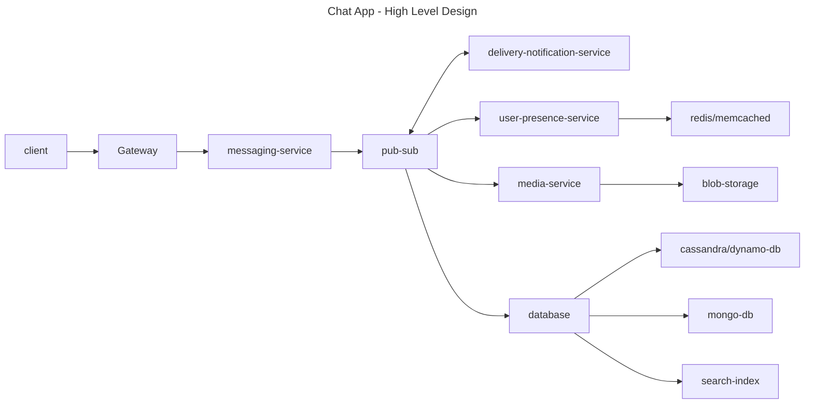

# Design Messaging System

# Scope
  - Web vs Mobile
  - enterprise vs social
  - features:
    - group chat
    - 1 vs 1
    - User status
    - Message status
    - Media support
    - Push notifications
    - encryption
  - NFR:
    - Scalability (100 Millions+)
    - Low Latency
    - High Availability
    - Error Handling/Fault Tolerance
    - MultiDevice Support
  - Assumptions:
    - message size: 5KB
    - DAU: (20 million users)
    - Group Size: 100+

# High Level Design
  - client app
    - ui for chat/contacts/groups
    - encryption
    - local storage
    - encryption/decryption
    - push notifications
  - gateway / API layer
    - rate limiting
    - security/authn
    - routing to services
  - messaging service
    - send message
    - receive message
    - message id generation
    - ordering and deduplication
  - kafka pub/sub system to send/receive messages
    - decouple sender/receiver and provide durability
    - each user/group has a topic
  - delivery & notification service
    - track & update message delivery
    - push notification via (FCM - Firebase Cloud Messaging or APN - Apple Push Notifications)
    - Retry and Error handling
  - user status service
    - Track user presence(active | last seen | typing)
    - Redis or Memcached
    - fire & forget messages that expire on time
  - media service
    - BLOB storage for media/files
    - generate secure url's
    - use CDN for fast delivery
  - database
    - KV store for messages (Cassandra/DynamoDB)
    - user/group in mongo DB or postgresSQL
    - indexing for search



# Deep Dive

  - Real time communication
  - wss for real time text messaging, user status and notifications
      - use backoff strategies when communication fails
      - queue unsent messages
  - mqtt if it is an IOT app with low bandwidth or battery (maybe older device with limited bandwidth)
  - http long polling if wss fails
  - grpc for internal microservice communication
  - Data Model
      - User {user_id, name,     phone, status, profile_pic}
      - Group {group_id, name, members[], admins[]}
      - Message {message_id, sender_id, receiver_id/group_id, content, send_ts, receive_ts, status, message_type}
  - Scalability
      - Kafka can scale horizontally
      - Cassandra can scale horizontally by adding more nodes
      - database partition by user_id or region
      - Rate limiting
  - Availability
      - Cassandra is HA with tunable consistency
      - Cassandra supports heavy write use cases with LSM engine
      - Redis/memcached for user presence service &  fire-forget notifications
  - Security
      - end-to-end encryption
      - messages are encrypted on client side
      - server only has access to encrypted messages
      - secure media links with expiration
  - Push Notification
      - FCM or APN
      - when app is offline or running in background
      - sync messages only since last sync timestamp
      - store chats locally
  - Message Acknowledges
      - Client -> Server (sent) -> Receiver (delivered) -> Read (viewed)
  - Presence & Typing
      - user_id -> online | offline | typing
      - expiry based notifications

## End to End Message Delivery Flow with Kafka

  - 1 user types message and hits send
    - message is encrypted and send to messaging service
  - 2 messaging service:
    - validates message
    - timestamps message
    - generates & assigns message_id
    - saved to database (eg: cassandra)
    - publishes to kafka on receiver-id or chat-messages topic
    
```java

kafkaProducer.send(new ProducerRecord("chat-messages", receiverId, content));

```
  - 3 consumer service subscribes to kafka 

```java
@kafkalistener(topic="chat-messages")
public void onMessage(Message message) {
    deliverToUser(message);
}

public void deliverToUser(Message message) {
    String userId = message.getReceiverId();

    try {
        webSocketHandler.sendMessageToUser(userId, serialize(message));
    } catch (IOException e) {
        // Observability or Alerting Service Integration 
    }
}
```

  - 4 Message Delivery
    - if user is online:
      - message is sent to app using wss or grpc
    - if user is offline:
      - send push notification via FCM or APN
  
  - 5 Ack Back sent to Delivery (wss or another kafka topic)
    - message delivery notification sent
    - user reads message sent 

## End to End User Presence Flow

- 1 User opens app or is reading messages store a key like presence:123 = online

```bash

SET presence:user123 "online" EX 30

```

- 2 when user stays active, client keeps refreshing the key so it doesn't expire
- 3 when user exits app key automatically expires
- 4 Typing indicator - auto expires in 5 seconds if no further signal is sent
```bash

SET typing:user123:chat456 "typing" EX 5
```

## Scaling Kafka

- Basics
  - topic is logical stream of messages
  - topics are divided into partitions, each partition is a unit of parallelism & storage
  - partitions are append only logs order by offset

- number of partitions 
  - determine parallelism for producers & consumers 
  - more partitions --> more concurrent read/writes

- Producer Partition Strategy
  - define partition key to decide how messages are routed
    - ex: receiverId or groupId
  - ordering is preserved with in the partitions

- Consumer Scaling
  - 1 partition can be read by utmost one consumer in a consumer group
  - consumers in consumer group share partitions
  - if more consumers are there than partitions, some consumers remain idle

- Broker Scaling
  - Brokers host partitions
  - replication factor for handling Durability

| Problem                             | Fix                                                   |
|-------------------------------------|-------------------------------------------------------|
| High consumer lag                   | Add more partitions or speed up processing            |
| Uneven partition load               | Check key distribution — hot keys?                    |
| Broker overloaded                   | Add brokers or rebalance partitions                   |
| Throughput bottleneck               | Compress messages (Snappy, lz4), batch size/linger.ms |
| Metadata overload (too many topics) | Consolidate into fewer high-volume topics             |
| Storage                             | Tiered Storage for ( > 7 days)                        |

- Assumptions
  - Capacity for 20 million DAU, 20 chats (users/group) and 5KB messages per day
  - Daily Message Volume = 400 million message * 5 KB/message = 2 TB/Day
  - message spread - uniform (simplified)
- Calculating Peak Load
  - 300K messages per minute
  - 5K messages per sec
  - Peak factor: 10
  - 50K messages per sec ~ Peak Load
- Number of Partitions
  - 1 Partition can handle 1 MB/sec
  - 50K * 5K messages -> 250 MB/sec -> 250 partitions
- Number of Brokers
  - 1 broker can handle 200 MB/sec
  - replication factor ~ 3
  - we need a peak support of 250 MB/sec * 3 ~ 750 MB -> 4 Brokers
- Kafka Storage
  - 2 TB/Day * 3 (replication factor) *7 days ~ 42 TB
- ws connections per server
  - 1 mid-tier server can handle 10K–100K open WSS connections
  - DAU = 20M → assume 5M concurrently online
  - 50 - 500 Fan-out/Push server/delivery servers (Node.js, Netty)
- Network Throughput
  - 250 MB/sec ingest and 250 MB/sec fanout
  - 10 Gbps servers can handle this load
- Push Notification Servie
  - 10M offline users -> 10M FCM pushes 
  - FCM sender - 10-20K notifications per sec
- Redis Memory
  - 5M users * 100 bytes/key ~ 500 MB Redis RAM
  - 1-2 shards can easily handle this


- Summary for 20M DAU, 5KB messages, 20 messages/user/day

| Component    | Estimate                                |
|--------------|-----------------------------------------|
| Messages/day | 400 million                             |
| Data/day     | ~2 TB                                   |
| Partitions   | 500–1000 (optimize per use case)        |
| Brokers      | 8–10 Kafka brokers                      |
| Replication  | Factor = 3                              |
|  Consumers   | Depends on use case (max = #partitions) |

- Handle Hot Partitions Causes/Remedies:
  - sticky partition from producers (ex: partionId = 1)
    - Use better partition keys
    - for group chats use groupId+":"+userId 
  - one groupId or userId dominates messages 
    - use salt groupId:1, groupId:2
    - downside is you loose ordering
  - not enough parallelism to spread load
    - add more partitions
  - split topics by use case
    - chat-messages vs system-notifications vs audit-log
  - consumer side parallelism
    - if partitions are maxed out then cg parallelism can help

- how many topics do we need?

| Topic Name    | Purpose                                 |
|---------------|-----------------------------------------|
| chat-messages | All messages (partitioned by chatId)    |
| chat-typing   | Ephemeral events (short TTL consumers)  |
| chat-presence | Online/offline pings                    |
| media-events  | Media uploads/download logs             |
| audit-logs    | Compliance logs (long retention)        |

- Consumer Service Scaling
  - Each partition is assigned to exactly one consumer within a group
  - If you have 500 partitions, you can have up to 500 active consumers in a group
  - Kafka automatically handles rebalance when consumers join/leave
  - Handling Large Number of Partitions
    - Option 1: Scale Out Consumers in a Group
    - Option 2: Process Multiple Partitions per Consumer
  - Use thread pools if each consumer handles many partitions
  - Monitor lag per partition using kafka-consumer-groups.sh or Prometheus
  - Use batch processing (max.poll.records) for efficiency
  - TL;DR;
    - The consumer of Kafka is a backend "Consumer Service", not the client app.
    - Clients should not be tightly coupled to Kafka (or any broker)
    - Clients interact with a real-time push layer, not a broker
    - Consumer Service = Scalable "Delivery Engine"
    - Consumer Service forwards them to connected clients via:

| Transport Layer    | Client Usage                                  |
|--------------------|-----------------------------------------------|
| WebSocket (WSS)    | Web browsers, mobile apps                     |
| gRPC Streaming     | Native apps (Android, iOS, backend services)  |
| Push Notification  | Offline/battery saver use case                |

# End-to-End Encryption

1. Key Generation and Management
   - each user install of app generates the private_key and public_key establishing users identity.
   - public_key is stored on a **keyserver**, while private_key is never shared
   - E2EE requires 4 keys:
     - identity key pair
     - signed key pair
     - one time key pair 
     - session keys 
   - aws **KMS** can be used an extra layer of security for the metadata stored on the middleware

2. message encryption flow
   - when alice wants to send message to bob, app gets bob's public key bundle
   - X3DH (alice's private key + bob's public key bundle) exchange -> session key
```java 
   String cipherText = encrypt(sessionKey, message);  
```
3. what is sent in the message exchange?
```json
  {
    "from": "alice",
    "to": "bob",
    "cipher_text": "ENCRYPTED_MESSAGE",
    "session_header": {
      "ephemeral_key": "abc123....",
      "dh_ratchet": "xyz456....",
      "mac": "message authentication code"
    }
  }
```
    - back end can store but not decrypt message

4. message decryption flow
   - bob uses his private + ephemeral public key in message to establish alice's identity
   - bob generates symmetric session key and decrypt's the message
```java
   String message = decrypt(sessionKey, cipherText);  
```

5. session key & the double ratchet algorithm (under the hood)
   - session key is a temporary symmetric key used to encrypt/decrypt 
   - session key changes everytime you send or receive message providing forward secrecy

   - how do you get first session key?
```bash
Key Pairs

Bob’s Keys:
Identity key: Private (IK_b), Public (IK_B).
Signed pre-key: Private (SPK_b), Public (SPK_B).
One-time pre-key: Private (OPK_b), Public (OPK_B).

Alice’s Keys:
Identity key: Private (IK_a), Public (IK_A).
Ephemeral key: Private (EK_a), Public (EK_A).

Alice’s DH Computations
Alice retrieves Bob’s public keys (IK_B, SPK_B, OPK_B) from the AWS-hosted Key Server (e.g., DynamoDB). She computes:

DH1 = DH(IK_a, SPK_B): Alice’s private identity key with Bob’s public signed pre-key.
DH2 = DH(EK_a, IK_B): Alice’s private ephemeral key with Bob’s public identity key.
DH3 = DH(EK_a, SPK_B): Alice’s private ephemeral key with Bob’s public signed pre-key.
DH4 = DH(EK_a, OPK_B): Alice’s private ephemeral key with Bob’s public one-time pre-key (if used).
Each DH operation uses Alice’s private key (IK_a or EK_a) and Bob’s public key (IK_B, SPK_B, or OPK_B).

Bob’s DH Computations
Bob receives Alice’s public keys (IK_A, EK_A) in the initial message (via SQS or WebSocket). He computes:

DH1 = DH(SPK_b, IK_A): Bob’s private signed pre-key with Alice’s public identity key.
DH2 = DH(IK_b, EK_A): Bob’s private identity key with Alice’s public ephemeral key.
DH3 = DH(SPK_b, EK_A): Bob’s private signed pre-key with Alice’s public ephemeral key.
DH4 = DH(OPK_b, EK_A): Bob’s private one-time pre-key with Alice’s public ephemeral key (if used).
Each DH operation uses Bob’s private key (IK_b, SPK_b, or OPK_b) and Alice’s public key (IK_A or EK_A).

Final Session Key
Both parties concatenate the DH outputs (DH1 || DH2 || DH3 || DH4).
They feed the concatenated result into a Key Derivation Function (KDF) (e.g., HKDF with SHA-256) to derive the shared session key (SK).
The session key initializes the Double Ratchet Algorithm for message encryption.
```
   - how do you double ratchet?
     - Once you have a shared session key → you now evolve it securely every time a message is sent or received.
     - The Double Ratchet = 2 types of key updates:
        1. For every message, generate a new message key (forward secrecy) if someone gets key_99, they can’t decrypt key_1 to key_98
        2. Diffie-Hellman Ratchet (New Ephemeral Keys)
          - Periodically (e.g., when roles switch or message gaps occur), both users generate new ephemeral DH keys
          - They exchange public parts and re-run a new DH exchange:
```bash
1. new message key
message_key_N = KDF(chain_key_N-1)
chain_key_N = KDF(chain_key_N-1)

2. periodically refresh DH keys
shared_secret_new = DH(my_new_private, their_new_public)
New shared secret → new base for symmetric ratchet

```

# Wrap Up
- Handling 10 fold increase from 20 million ADU to 200 million ADU 


| Component     | 20 million  DAU                         | 10X Scaling      - 200 million  DAU |              
|---------------|-----------------------------------------|-------------------------------------|
| Messages/day  | 400 million                             | 4B                                  | 
| Data/day      | ~2 TB                                   | 20 TB                               |
| Partitions    | 500–1000 (optimize per use case)        | 10k - 20K partitoins                |
| Brokers       | 8–10 Kafka brokers                      | 80 - 100 brokers                    |
| storage       | 42 GB (rep factor = 3)                  | 16TB ~ 20 TB                        |
| retention     | 7 days                                  | 30 days                             |
| cassandra     | 15 - 30 nodes                           | 150- 300 nodes                      
| Consumers     | Depends on use case (max = #partitions) |                                     |
|Peak throughput (replication 3x) | 	~690MB/sec                             | 6.9GB/sec                           |
| Redis user persence service| 1 - 2 shards                            |    50 shards|
| websocket servers | 50-100 | 500 - 1000 servers|

- Scaling to 200M users means thinking multi-region, multi-tenant, and multi-layered:
  - Async everywhere
  - Encryption-first
  - Observability & rate-limiting
  - Failure isolation: regional failover, circuit breakers