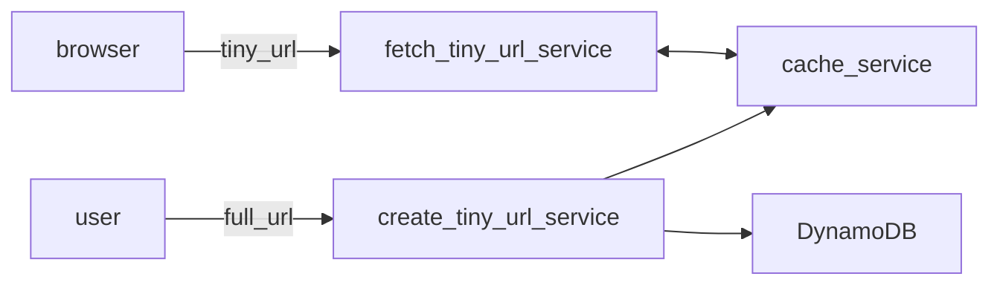

# tiny url service

# Scope
- Features:
  - user can paste & go a tiny url in browser & hit go, the tinyurl service will redirect to long url
  - service to create tiny url's
    - long url -> tiny url
  - delete or update tiney url requirements?
  - auto delete any stale urls?
  - user initiated deletes
  - update urls
      - why not create a new tiny url?
      - new users receive the updated url in redirects

- NFR's:
  - scalable: handle millions of requests per day
  - store billions of url's
  - HA: many 9's
  - low latency - ms response in redirects
  - observability/usage analytics

- Assumptions:
  - 1 million full urls:
    - 4KB full url's ~ 2048 chars
    - 1 tiny url < 100 char's  ~ 200 Bytes
  - 100 K DAU's per day
  - Growth:
    - 1 million full urls to 100 million full urls (100X)
    - 100K DAU's to 10 million DAU's  (100X)

# High Level Design

- service to create a tiny url
- web server to host the tiny url application
  - issue redirects
  - HA: Horizontal auto scaling
- Back End:
  - Cache: for fast look up of url's
    - new url creation hits cache and backend
  - Dynamo DB in preference to Relational like Oracle
    - prefer availability in case of partitions & support eventually consistency 



# Deep Dive

- API flow

```http

POST /tinyUrl {full_url}  
response tiny.url/short_url

GET /short_url
Response:
    Status: 302
    Location: <full_url>
```

- Service
  - create short url
    - uniqueId generator for each full url 
      - simple to call the increment uniqueId generator 
      - store the next value for restarts/ share or scale with a prefix for each server
    - Convert unique Id to hexadecimal
      - serves as a partition key for Dynamo DB
      - no additional sort key is required
    - Save to Dynamo DB as
      - partition key
      - attributes of record are  full_url, created_by, created_timestamp
      
  - fetch full url
    - check cache for short url
      - return full url if found
      - if not found query dynamo DB attribute Full_Url, save in cache and return
    - issue redirect
    - update usage/observability metrics
    
 - Dynamo DB model

| Partition | Full_Url     | created_by | created_timestamp        | 
|-----------|--------------|------------|--------------------------|
| abc123    | http://url1  | user       | 2025-01-12 20:21:12.123  |

- Storage
  - 1 million full urls ~ 4KB * 1 million  ~4 GB  (1 partition has typically 10 GB)
  - Usage 100 K DAU's
    - cache frequent short urls to avoid RCU's on Dynamo DB & reduce latency
    - 1 request per sec (assuming uniform load)
    - 1 web server can handle this load
- Observability
  - tiny1, user agent/browser details, access time, location details

# Wrap Up
- Growth
    - 1 million full urls to 100 million full urls (100X)  --> 400 GB  ~ 40 partitions (easily handled by DynamoDB)
    - 100K DAU's to 10 million DAU's  (100X)  --> 100 req per sec  --> can split load easily across 2 to 3 http/nginx servers
- CDN and cloud front for low latency
- Observability to Usage Reports for Clients