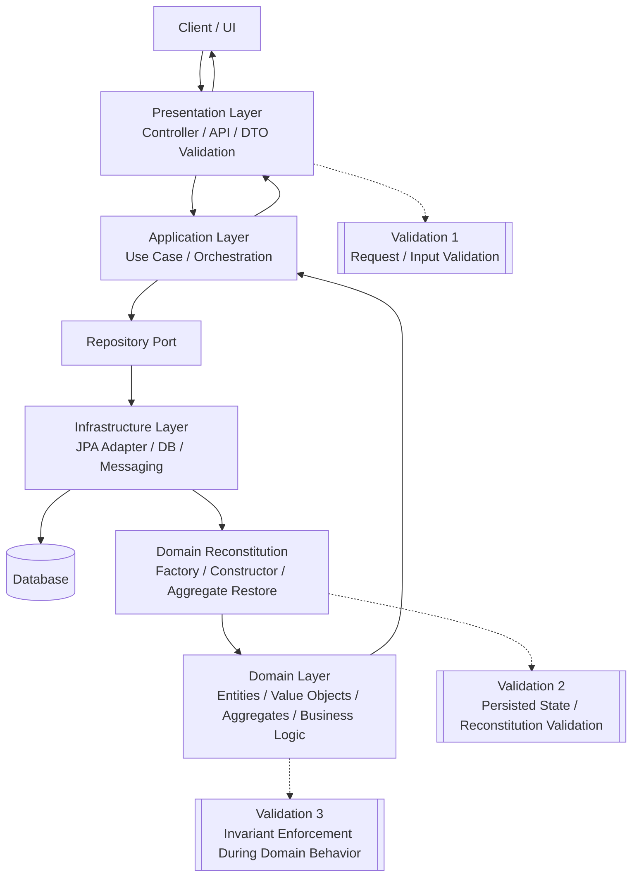
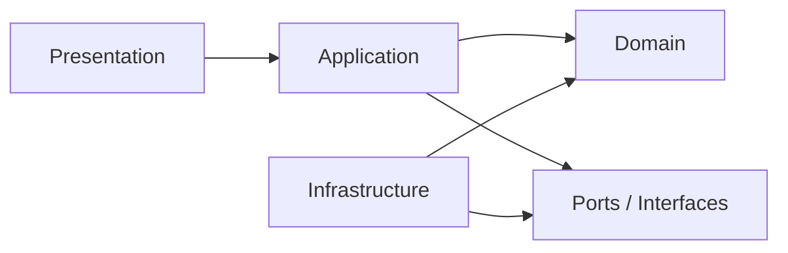

# DDD layering mapped to Spring Boot 

## Payments Bounded Context
* initial package
```package
        
com.example.payments
├── presentation
│   ├── api
│   │   ├── PaymentController.java
│   │   ├── dto
│   │   │   ├── CreatePaymentRequest.java
│   │   │   └── PaymentResponse.java
│   │   └── mapper
│   │       └── PaymentApiMapper.java
│
├── application
│   ├── service
│   │   └── PaymentApplicationService.java
│   ├── command
│   │   └── CreatePaymentCommand.java
│   ├── port
│   │   ├── in
│   │   │   └── CreatePaymentUseCase.java
│   │   └── out
│   │       └── PaymentRepository.java
│   └── mapper
│       └── PaymentCommandMapper.java
│
├── domain
│   ├── model
│   │   ├── Payment.java
│   │   ├── PaymentId.java
│   │   ├── Money.java
│   │   └── PaymentStatus.java
│   ├── service
│   │   └── PaymentDomainService.java
│   ├── exception
│   │   ├── DomainValidationException.java
│   │   └── InvalidAggregateStateException.java
│   └── factory
│       └── PaymentFactory.java
│
├── infrastructure
│   ├── persistence
│   │   ├── entity
│   │   │   └── PaymentJpaEntity.java
│   │   ├── springdata
│   │   │   └── SpringDataPaymentRepository.java
│   │   └── PaymentRepositoryAdapter.java
│   ├── messaging
│   ├── config
│   └── exception
│
└── shared
└── GlobalExceptionHandler.java
```

* first revision
```package
com.example.payments
├── presentation
│   └── api
│       ├── PaymentController.java          # Calls use cases
│       ├── dto
│       │   ├── CreatePaymentRequest.java
│       │   └── PaymentResponse.java
│       └── mapper                          # API DTO <-> Command
│           └── PaymentApiMapper.java
│
├── application
│   ├── usecase                             # Or port/in
│   │   └── CreatePaymentUseCase.java       # Orchestrates: map -> factory -> domain service -> repo
│   ├── command
│   │   └── CreatePaymentCommand.java       # command in CQRS
│   └── query                               # If a separate Read is required in CQRS needed
│
├── domain                                  # no spring/jpa annotations
│   ├── model                               # Entities/VOs
│   │   ├── Payment.java                    # Aggregate root
│   │   ├── PaymentId.java                  # Value Object
│   │   ├── Money.java                      # Value Object
│   │   └── PaymentStatus.java              # enum
│   ├── service
│   │   └── PaymentDomainService.java       # Pure domain logic
│   ├── repository                          # Ports
│   │   └── PaymentRepository.java          # Moved from application/port/out
│   ├── event                               # Domain events
│   │   └── PaymentCreatedEvent.java
│   ├── exception
│   │   ├── DomainValidationException.java
│   │   └── InvalidAggregateStateException.java
│   ├── factory
│   │   └── PaymentFactory.java
│   └── mapper                              # Domain <-> Command (if needed)
│
├── infrastructure
│   ├── persistence
│   │   ├── entity
│   │   │   └── PaymentJpaEntity.java
│   │   ├── jpa                             # Renamed from springdata
│   │   │   └── PaymentJpaRepository.java
│   │   └── PaymentRepositoryAdapter.java   # Implements domain.PaymentRepository
│   ├── messaging
│   │   └── PaymentEventPublisher.java      # Publishes domain events
│   ├── config                              # Spring beans/config
│   └── exception                           # Infra-specific
│
└── shared                                  # Cross cutting concerns
    ├── domain                              # Base: ValueObject, Entity, AggregateRoot
    └── exception
        └── GlobalExceptionHandler.java     # Or move to infrastructure
```

* second revision
```package
com.example.payments
├── presentation
│   └── api
│       ├── PaymentController.java          # Thin: maps request -> calls app service/use case
│       ├── dto
│       │   ├── CreatePaymentRequest.java   # Inbound API DTO (also called as View Models)
│       │   └── PaymentResponse.java        # Outbound API DTO
│       └── mapper
│           └── PaymentApiMapper.java       # Request -> Command (one-way primary)
│
├── application
│   ├── service
│   │   └── PaymentApplicationService.java  # Orchestrates use cases, transactions, events
│   ├── port
│   │   └── in
│   │       ├── CreatePaymentUseCase.java   # Input port: thin orchestrator
│   │       ├── mapper
│   │       │   └── PaymentCommandMapper.java  # Command <-> Domain (moved here, no domain pollution)
│   │       └── CreatePaymentCommand.java   # App DTO
│   └── query                               # CQRS if needed (e.g., PaymentQueryUseCase)
│
├── domain
│   ├── model                               # Entities, VOs
│   │   ├── Payment.java                    # Aggregate root
│   │   ├── PaymentId.java
│   │   ├── Money.java
│   │   └── PaymentStatus.java
│   ├── service
│   │   └── PaymentDomainService.java       # Pure business logic (stateless)
│   ├── repository                          # Outbound ports (interfaces)
│   │   └── PaymentRepository.java          # save/find etc.
│   ├── event                               # Domain events
│   │   └── PaymentCreatedEvent.java
│   ├── outbound_port                       # Event outbound port
│   │   └── PaymentEventPort.java           # publish(DomainEvent)
│   ├── exception
│   │   ├── DomainValidationException.java
│   │   └── InvalidAggregateStateException.java
│   └── factory
│       └── PaymentFactory.java
│
├── infrastructure
│   ├── persistence
│   │   ├── entity
│   │   │   └── PaymentJpaEntity.java       # JPA @Entity
│   │   ├── jpa
│   │   │   └── PaymentJpaRepository.java   # SpringDataJpaRepository<PaymentJpaEntity>
│   │   └── PaymentRepositoryAdapter.java   # Implements domain.PaymentRepository
│   ├── messaging
│   │   └── PaymentEventPublisherAdapter.java  # Implements domain.PaymentEventPort (Kafka/Rabbit)
│   ├── config                              # @Configuration, @Bean wiring (adapters, etc.)
│   │   └── PaymentConfig.java
│   └── exception                           # Infra handlers
│
└── shared
    ├── domain                              # Base classes: ValueObject, AggregateRoot, DomainEvent
    └── exception
        └── GlobalExceptionHandler.java     # @ControllerAdvice
```

### Note: 
- PaymentApplicationService in application/service orchestrates.
```text
  Flow is: Controller (5 lines) → map Request→Command → ApplicationService → UseCase → Domain → Ports
 ```
- shared domain Avoids duplication across domain subdomains/bounded contexts. 
  Centralizes reusable DDD primitives. acts as  DDD foundation library. Keeps 
  domain/model lean/focused on payments business rules. 

## Layer responsibilities
1. Presentation: Spring Boot annotation: @RestController
- It should not contain domain rules.
- DTO's are also called "view models".

2. Application: Spring Boot annotation: @Service on use-case orchestration class
- command objects (intent to change domain)
- ports/interfaces

3. Domain: No Spring Annotations are needed
- guard invariant validity

4. Infrastructure: Spring Boot annotation: JPA entities & Spring Data repositories

## Validation points in Spring Boot terms
- UI / API boundary validation: edge validation, not domain validation.
  -  @NotBlank, @NotNull, @Positive
- Application-level validation: Useful for use-case-specific checks before 
  domain execution.
  - This layer coordinates, but the true invariant still belongs in domain.
- Repository reconstitution validation:
  - corrupted DB data
  - legacy inconsistent state
  - mapper bug
  
## Error handling shape in Spring Boot
A clean pattern is:
- MethodArgumentNotValidException → 400
- DomainValidationException → 422 or 400 depending on style
- InvalidAggregateStateException during reconstitution → 500 or operational 
  alert, because system data is corrupt

## Other annotations
- @Transactional
  - Belongs in Application layer (mostly)
  - Put it on use case methods (service layer)
  - **Avoid:** 
    - putting it in domain
    - scattering it across repositories unnecessarily
```java
@Service
public class PaymentApplicationService {

    @Transactional
    public Payment createPayment(...) {
        // load → domain logic → save
    }
}
```

- @ComponentScan
  - Configuration concern (Infrastructure / Boot layer)
  - Usually replaced with **@SpringBootApplication** which Already includes:
    * @ComponentScan
    * @EnableAutoConfiguration
  - Used for Bootstrapping / wiring beans
  - Not part of DDD layers conceptually

```java 
@SpringBootApplication
public class App {}
```

- Testing: Unit test domain in isolation; integration test adapters.

## Maven/Gradle Modules Per Layer (Domain Independent) - Enforcing Strict Layering!
- Multi-module build enforces dependency inversion at compile-time:
    - Domain has zero Spring deps → pure, testable.
    - Infra/presentation depend upward via ports. Prevents accidental Spring leakage.

```text
parent-pom/
├── domain/              # Pure Java, no Spring deps
├── application/         # deps: domain
├── infrastructure/      # deps: domain+application+spring-boot-starter*
└── presentation/        # deps: application+spring-boot-web
```

- @ComponentScan Only Infrastructure/Presentation
    - @ComponentScan = runtime dependency inversion.
    - Application layer uses @Service (needs transactions/orchestration) but
      injects domain ports
    - Without module boundaries + scan control, @EntityScan/@EnableJpaRepositories
      in infra could accidentally pull domain into Spring context.

```java 
@SpringBootApplication
@ComponentScan({
        "com.example.payments.application",      // @Service, @Transactional  
        "com.example.payments.infrastructure",   // @Repository adapters
        "com.example.payments.presentation"      // @Controller
})
```

## IOC and DI using Ports & Adapters

|Concept 	|Role in the Architecture|
|-----------|-----------|
|Inversion of Control (IoC) |	The Principle: Decoupling the "what" from the "how".|
|Ports (Interfaces)	| The Contract: Defined by the Domain to specify its needs.|
|Adapters (Classes)	| The Detail: Implementations that fulfill the port's contract.|
|Dependency Injection (DI)	| The Mechanism: The act of passing the Adapter into the Core.|

- **IOC** shifts the responsibility of defining dependencies from the 
  "consumer" (the code that needs a service) to the "provider" (an external 
  entity).
- **DI** is the specialized pattern used to realize IoC by providing the concrete 
adapter to the domain at runtime.
  - **Wiring:** An IoC Container like Spring or Google Guice is responsible for 
    instantiating the adapter and "injecting" it into the domain service.
  - **Injection Method:** Usually done via Constructor Injection. The domain 
  service declares a constructor that accepts the Port interface; the container 
  then passes the concrete Adapter instance into that constructor.
- The **adapter** handles technical details (SQL queries, API calls) and 
  translates them into domain-friendly objects, acting as an Anti-Corruption 
  Layer (ACL).
  - Interface (PaymentRepository) stays in domain/repository. Adapter 
  implements the port and uses SpringDataPaymentRepository.

## Typical Flow - DDD layering with validation

- call sequence

```flow
HTTP Request
   ↓
Controller + DTO validation
   ↓
Application Service / Use Case
   ↓
Repository loads aggregate
   ↓
Domain reconstitution validates persisted correctness
   ↓
Domain behavior executes and re-validates invariants
   ↓
Repository saves aggregate
   ↓
Response returned
```

- flowchart



- Dependency view
  - Presentation depends on Application
  - Application depends on Domain
  - Infrastructure depends on Domain contracts / models
  - Infra implements interfaces used by Application/Domain



- Alternate explanation
  - Presentation starts the request
  - Application orchestrates the use case
  - Domain executes business behavior
  - Infrastructure supports persistence/integration

## Other Flows
- Application does NOT always go to infra first. For create flows, it may:
  - Application → Domain.create() → save via infra
  - No prior load needed.

- After domain logic, domain returns updated aggregate then Application decides:
  - persist
  - publish events (use Event Object's)
  - call other services

- Read-only query (CQRS-style):
  - Application → infra → DTO (skip domain sometimes)
  
- Domain events:
  - Domain raises event → Application/Infra publishes (Kafka, etc.)

- External calls:
  - Application → port → infra (e.g., payment gateway)

## Further Enhancements
### domain services for idempotency
- **Usage:** if (idempotencySvc.isDuplicate()) throw DuplicatePaymentException();
```java    
  // domain/service/IdempotencyService.java
  boolean isDuplicate(PaymentId id, String operationId);  // Check before create
  void markProcessed(PaymentId id, String operationId);   // After success
```
- Flow:
```text
PaymentAppService.create(CreatePaymentCommand cmd):
    1. if(idempotencySvc.isDuplicate(cmd.paymentId, cmd.operationId)) // operationId from API request (client-provided UUID)
            return existing payment  // Idempotent: skip work
    2. Payment payment = paymentFactory.create(cmd)  
    3. paymentRepository.save(payment)
    4. idempotencySvc.markProcessed(cmd.paymentId, cmd.operationId)  // Commit idempotency
```

### Payment Failure Saga a.k.a implementing saga via messaging
- Within single Payment BC (application.PaymentApplicationService):
```text
PaymentAppService.create():
    1. paymentRepository.save(payment) ✓  
    2. riskService.validate() ✗ // Payment's own risk check fails.
    3. sagaPort.compensate(paymentId)
    4. Payment.cancel() → PaymentCancelledEvent (local)
```
  - Key Components:
```java
// domain/outbound_port/SagaPort.java
void compensate(PaymentId id);  // Rollback on failure

//infrastructure/messaging/PaymentSagaOrchestrator.java  
// Listens PaymentFailedEvent → triggers compensate() on other services
```
- Notes:
  - Saga spans services NOT BC's (Bounded Context)
  - Payment BC stays focused: local compensation Only
  - External choreography: Via published events (PaymentCancelledEvent)

## References
- https://chatgpt.com/g/g-p-698f44b7ee788191823229d54bda6877-tech-interview/c/69dbdf42-e938-8328-86e0-17d90a6bbec5
- https://www.perplexity.ai/search/help-me-refine-review-this-ddd-etsY7BRERia1QA0C1oKTEw