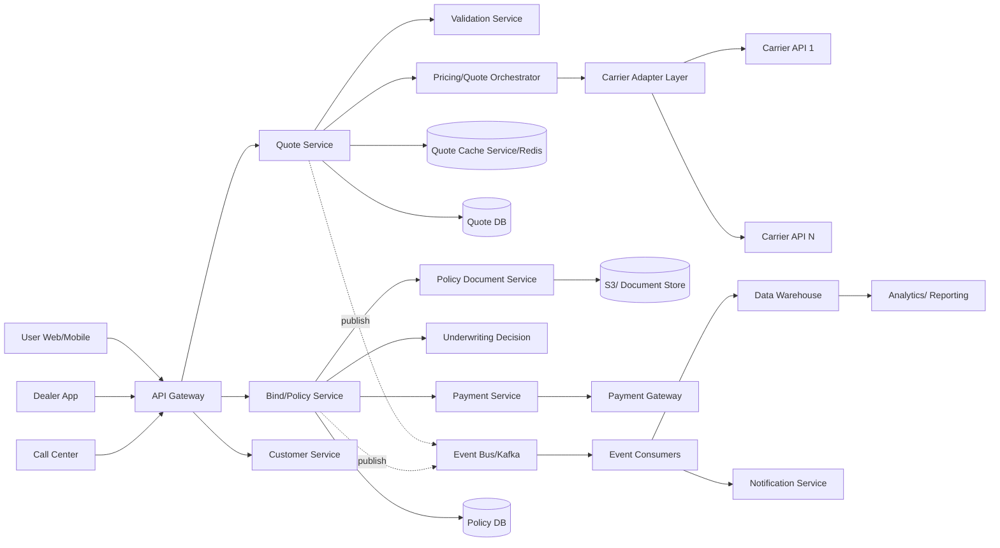

# Design Insurance Quote → Bind Platform

## Question
- Design a system where a customer gets a quote and purchases auto 
  insurance (web/app/dealer).

## Strong Answer (what they expect)
### Core services: 
 - Quote Service
 - Pricing Engine
 - Underwriting Adapter
 - Policy Service

### Flow:
   Request → Validate → Call carrier APIs → Normalize → Cache → Show quote → Bind → Issue policy

### Key Decisions
 - Aggregator vs single carrier abstraction
 - Latency: cache quotes (TTL ~5–15 min)
 - Idempotent bind (prevent duplicate policies)

### Architecture
 - API Gateway → Microservices → Kafka (quote events)

### Edge cases
 - Partial carrier failures
 - Re-quote on stale data

### Principal depth
 - Rate limiting per carrier
 - Multi-region failover
 - Compliance (state-specific rules)

## C2 - Container

### What each container does
* API Gateway / BFF
  - Auth, 
  - routing, 
  - rate limiting, 
  - channel-specific response shaping.
 
* Quote Service
  - Entry point for quote creation
  - QUote retrieval.
 
* Validation Service
  - Validates customer, 
  - vehicle, 
  - VIN, 
  - address, 
  - driver inputs.

* Pricing / Quote Orchestrator
  - Calls internal rules + external carrier adapters, 
  - aggregates quote options.
   
* Carrier Adapter Layer
  - Normalizes different insurer APIs into one internal contract.
  
* Bind / Policy Service
  - Converts accepted quote into issued policy.
  
* Underwriting Decision Service
  - Final eligibility / 
  - risk checks before bind.
  
* Payment Service
  - Premium payment authorization/capture.
  
* Policy Document Service
  - Generates policy docs, 
  - declarations, 
  - welcome package.
  
* Notification Service
  - Email / SMS / push for quote ready, 
  - bind success, 
  - payment failure.

* Event Bus
  - Async downstream publishing for audit, 
  - analytics, 
  - notifications.

### Main sequence

#### Quote flow
  * Customer enters vehicle + driver info.
  * API Gateway authenticates and forwards request.
  * Quote Service validates request.
  * Vehicle/driver enrichment happens.
  * Eligibility rules reject bad/ineligible cases early.
  * Pricing Orchestrator calls one or more carriers through adapters.
  * Responses are normalized into common quote model.
  * Best quote options are cached + stored.
  * Quote created event is published.

#### Bind flow
  * Customer selects a quote.
  * Bind Service looks up quote and checks freshness.
  * "Idempotency key" prevents duplicate policy issuance.
  * Final underwriting check runs.
  * Payment is authorized/captured.
  * Policy is issued and persisted.
  * Documents are generated.
  * Notification sent.
  * Policy-issued event published.

### APIs

#### Quote APIs
- POST /quotes
- GET /quotes/{quoteId}
- GET /quotes/{quoteId}/options

#### Bind APIs
- POST /policies/bind
- GET /policies/{policyId}
- GET /policies/{policyId}/documents

#### Partner/internal
- POST /carrier-adapter/{carrier}/quote
- POST /underwriting/check
- POST /payments/authorize

### DataModel

#### Quote
  - quoteId
  - vehicle/VIN
  - customerId
  - drivers[]
  - coverageSelection
  - premium
  - carrier
  - status
  - expiresAt

#### Policy
  - policyId
  - quoteId
  - customerId
  - effectiveDate
  - term
  - premium
  - carrierPolicyNumber
  - status

#### Payment
  - paymentId
  - policyId
  - amount
  - status
  - transactionRef

## Design Points
  * Adapter layer isolates carrier differences
  * Quote cache reduces latency and repeated partner calls
  * Idempotency key on bind avoids duplicate policy issuance
  * Async event bus decouples analytics, audit, and notifications
  * State-specific rules belong in eligibility / underwriting layers
  * Audit trail required for every quote revision and bind action
  * Use circuit breakers / retries around carrier APIs
  * Stale quote protection is critical before bind
 
## Failures, TradeOffs
  * Carrier API timeout
  * One carrier succeeds, another fails
  * Payment authorized but policy issuance fails
  * Customer retries bind
  * Quote expired between quote and bind
  * Duplicate request from dealer/call center

## Summary
- I would separate quote generation from bind issuance. 
- Quote service handles validation, enrichment, pricing orchestration, 
and carrier normalization. 
- Bind service handles quote freshness, idempotent conversion to policy, 
underwriting, payment, and document generation. 
- External insurers are isolated behind adapters, and 
- all major lifecycle changes are published to Kafka for audit, analytics, 
and notifications.