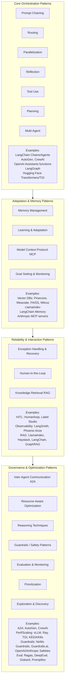

```mermaid

flowchart TB

subgraph G1[Core Orchestration Patterns]
A1[Prompt Chaining]
A2[Routing]
A3[Parallelization]
A4[Reflection]
A5[Tool Use]
A6[Planning]
A7[Multi-Agent]
Aex[Examples:<br/>LangChain Chains/Agents<br/>AutoGen, CrewAI<br/>OpenAI Assistants functions<br/>LangGraph<br/>Hugging Face Transformers/TGI]
end

subgraph G2[Adaptation & Memory Patterns]
B1[Memory Management]
B2[Learning & Adaptation]
B3[Model Context Protocol MCP]
B4[Goal Setting & Monitoring]
Bex[Examples:<br/>Vector DBs: Pinecone, Weaviate, FAISS, Milvus<br/>LlamaIndex<br/>LangChain Memory<br/>Anthropic MCP servers]
end

subgraph G3[Reliability & Interaction Patterns]
C1[Exception Handling & Recovery]
C2[Human-in-the-Loop]
C3[Knowledge Retrieval RAG]
Cex[Examples:<br/>HITL: Humanloop, Label Studio<br/>Observability: LangSmith, Phoenix Arize<br/>RAG: LlamaIndex, Haystack, LangChain, GraphRAG]
end

subgraph G4[Governance & Optimization Patterns]
D1[Inter-Agent Communication A2A]
D2[Resource-Aware Optimization]
D3[Reasoning Techniques]
D4[Guardrails / Safety Patterns]
D5[Evaluation & Monitoring]
D6[Prioritization]
D7[Exploration & Discovery]
Dex[Examples:<br/>A2A: AutoGen, CrewAI<br/>Perf/Scaling: vLLM, Ray, TGI, KEDA/K8s<br/>Guardrails: NeMo Guardrails, Guardrails.ai, OpenAI/Anthropic Safeties<br/>Eval: Ragas, DeepEval, Giskard, Promptfoo]
end

%% Layout relations
G1 --> G2
G2 --> G3
G3 --> G4
```