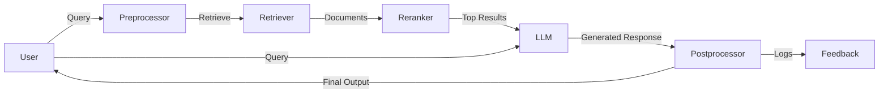

# Retrieval-Augmented Generation (RAG) Architecture

Retrieval-Augmented Generation (RAG) is an approach that enhances Large Language Model (LLM) responses by incorporating external knowledge from a retrieval system.
This improves factual accuracy, reduces hallucinations, and allows for more up-to-date responses.

---

## Architecture Overview

### Diagram

---

### Components:

1. **User Query Interface**
    - Accepts user input via a frontend application (web UI, chatbot, or API).

2. **Query Preprocessing**
    - Cleans and reformats the query for effective retrieval and generation.

3. **Retriever (Vector Search + Indexing)**
    - Uses a vector database (e.g., FAISS, Weaviate, Pinecone) to fetch relevant documents based on the query.
    - Indexes structured/unstructured data using embeddings generated by a Transformer-based model (e.g., OpenAI embeddings, BERT, or SentenceTransformers).

4. **Reranker (Optional)**
    - Re-ranks retrieved documents using a more precise ranking model to improve relevance.

5. **Large Language Model (LLM) with Context Injection**
    - The retrieved context is injected into the LLM prompt to generate a context-aware response.
    - Common models: OpenAI GPT-4, LLaMA, Claude, Mistral, or local LLMs.

6. **Postprocessing & Response Generation**
    - Filters, formats, and enhances responses before returning them to the user.

7. **Feedback & Logging**
    - Captures user interactions and performance metrics to improve retrieval and generation quality over time.

---

## High-Level Data Flow

1. **User sends a query** → Query Preprocessing
2. **Retrieve relevant knowledge** → Vector Search + Indexing
3. **(Optional) Re-rank retrieved documents**
4. **Inject retrieved data into LLM prompt**
5. **Generate response** → Postprocessing
6. **Return response to user**
7. **Log interactions for system improvements**

---

## Tech Stack

- **Frontend**: React, Flask/Django/FastAPI, Streamlit (for simple UI)
- **Vector Database**: FAISS, Pinecone, Weaviate, ChromaDB
- **LLM Provider**: OpenAI API, Local LLaMA/Mistral, Hugging Face models
- **Embedding Model**: OpenAI `text-embedding-ada-002`, BERT, or SentenceTransformers
- **Orchestration**: LangChain, LlamaIndex, Haystack
- **Storage**: PostgreSQL, MongoDB, S3 (for document storage)
- **Monitoring**: Prometheus + Grafana, OpenTelemetry

---

## Considerations

- **Latency vs. Accuracy**: Optimizing retrieval speed without sacrificing quality.
- **Security & Privacy**: Encrypting sensitive data and ensuring compliance (GDPR, HIPAA, etc.).
- **Scalability**: Efficient indexing and sharding techniques for handling large datasets.

---

## Future Enhancements

- **Hybrid Search**: Combining keyword search and vector embeddings for improved retrieval.
- **Multi-modal RAG**: Integrating images, audio, and structured data.
- **Active Learning**: User feedback-driven retraining for better relevance.

---

This document serves as a high-level guide to designing a simple yet effective RAG system with an LLM. Feel free to contribute improvements and enhancements!
