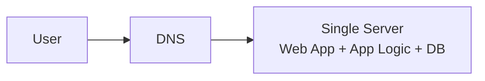
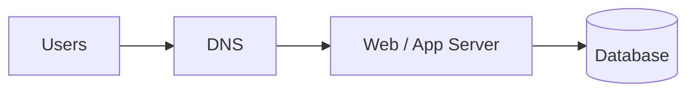
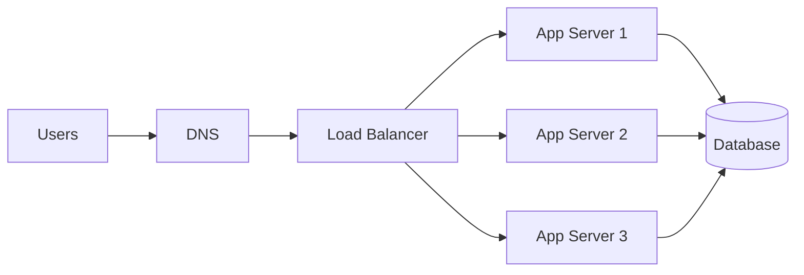
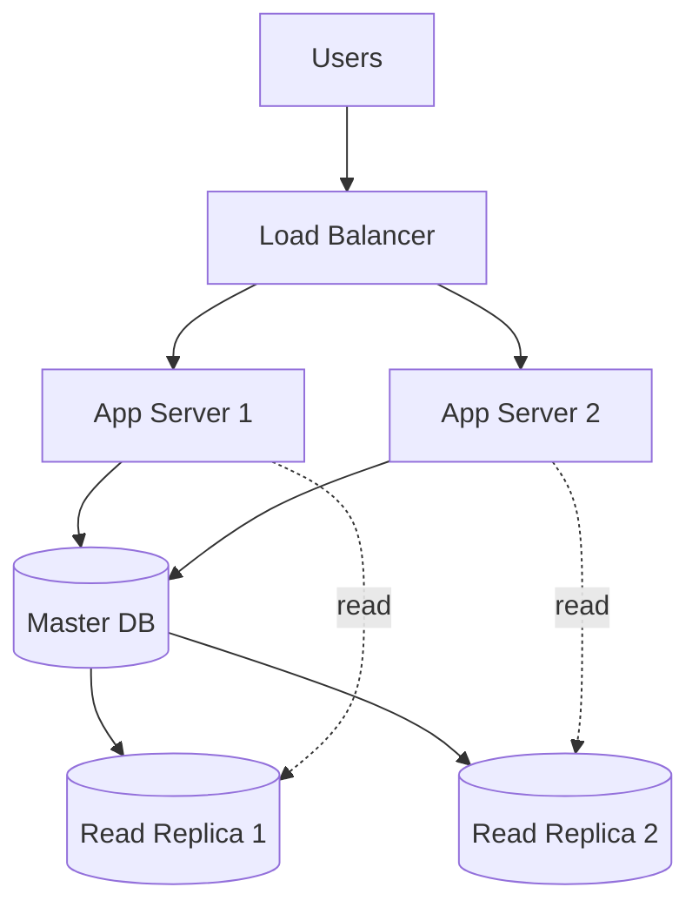
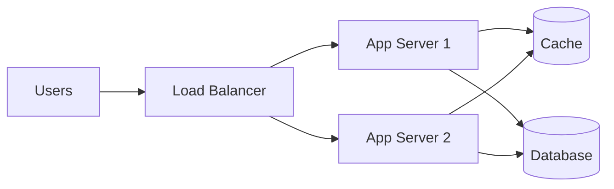
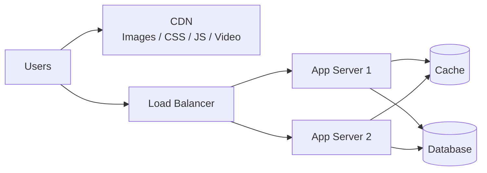
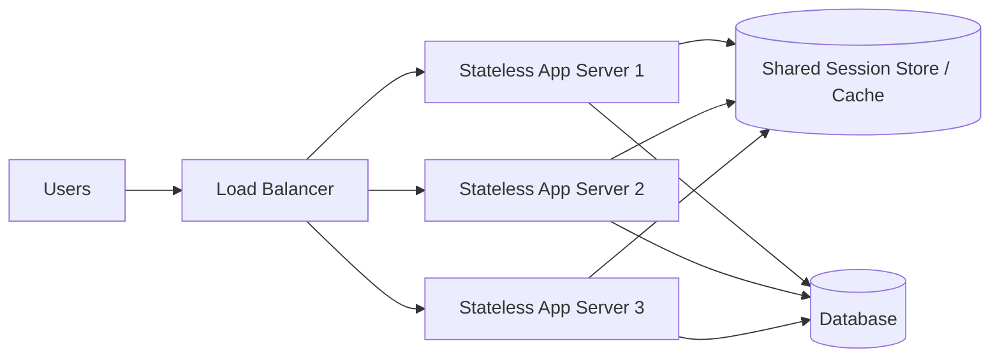
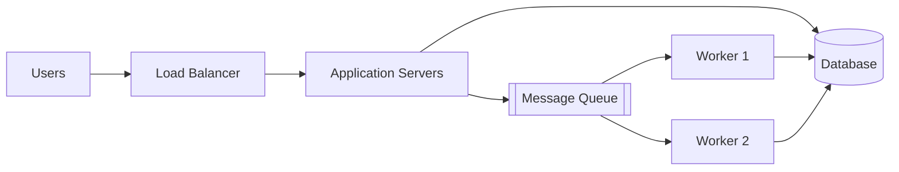
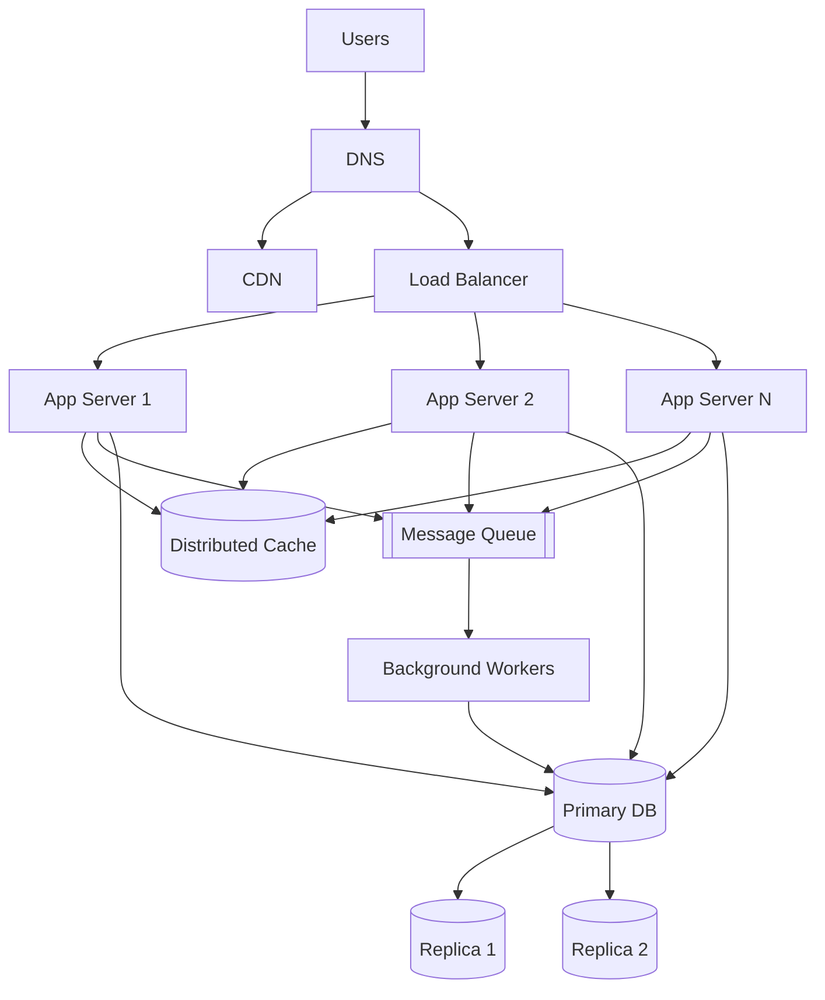

# Scale to Millions
- It is a journey!
- Build a System that start with a single user and gradually scale it to
  several million users
- Start with 1 user and continuously refine and improve endlessly!

## Single  server setup

## two-tier setup
- web & database can scale independently
- 1 to 2K user support
- Bottleneck = DB contention

### DB Choice
- Structured vs Unstructured
- Latency
- Data Volume

### Scaling DB
- Vertical vs Horizontal DB

## Load-balancer
- web tier is SPOF
- 10K users
- Bottleneck = single app server → horizontal scaling

## Database Replication
- master, slave DB replication to support 
- improved performance
- R scaling and HA support
- 100K users
- Bottleneck = DB reads → replicas

## Caching
- 1M users
- faster, but costlier
- cache:
  - expiration
  - eviction
  - cache frequently used data
  - consistency
- Bottleneck = latency + DB load → caching

## CDN
- A CDN is a network of geographically dispersed servers used to deliver 
  static content. 
- CDN servers cache static content like images, videos, CSS, JS files, etc.
- Avoid global latency
- 10M users
- Bottleneck = global latency + static assets → CDN

## Stateless app servers
- 50M users
- true "web tier horizontal" scaling
- store session data in the persistent storage such as relational database or NoSQL
- Bottleneck = session state → stateless + shared cache

## Asynchronous processing with message queue
- 100M+ users
- Bottleneck = long-running tasks → async queues

## Scale out Architecture
- fully distributed system
- 1B+ users
- Bottleneck = everything → full distributed system

https://chatgpt.com/g/g-p-698f44b7ee788191823229d54bda6877-tech-interview/c/69cb4b1c-a900-8326-8386-af5141086bf3